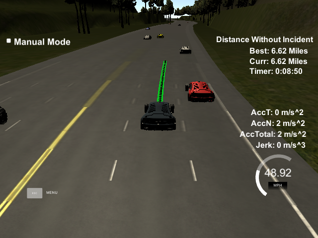
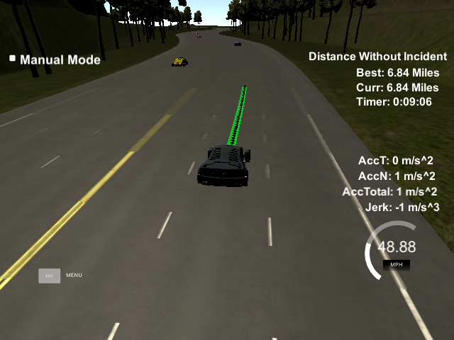

## Objective
The objective of the project is to drive a car on a highway without collition and by changind lanes while maintaining the speed limit, accelration and jerk.

## Rubric Points

### Compilation
Code compiles correctly with cmake. We are using spline.h library and added it in src folder.

### Valid trajectories
#### The car is able to drive at least 4.32 miles without incident.
I ran the simulator for 15 and 20 miles without incidents:

#### The car drives according to the speed limit.
No speed limit red message was seen.

#### Max Acceleration and Jerk are not Exceeded.
Max jerk red message was not seen.

#### Car does not have collisions.
No collisions.

#### The car stays in its lane, except for the time between changing lanes.
The car stays in its lane most of the time but when it changes lane because of traffic or to return to the center lane.

#### The car is able to change lanes
The car change lanes when the there is a slow car in front of it, and it is safe to change lanes i.e. no other car is coming or when it is safe to return the center lane.

### Reflection
Messages sent by simulator are listened in main.cpp. Simulator send the data related to Car's coordinate, speed, velocity, yaw rate and Frenet coordinates. Simulator also returns data from sensors which contains data of other cars.

The code consist of three parts:
#### Prediction 250 to 282
This part of the code deal with the telemetry and sensor fusion data. We want to know three aspects of it:

* Is there a car in front of us blocking the traffic.
* Is there a car to the right of us making a lane change not safe.
* Is there a car to the left of us making a lane change not safe.

We get these by calculating the lane each other car is and the position it will be at the end of the last plan trajectory. A car is considered "dangerous" when its distance to our car is less than 25 meters in front or behind us.

#### Behavior line 285 to line 307
This part decides what to do:

* If we have a car in front of us, do we change lanes?
* Do we speed up or slow down?

Based on the prediction of the situation we are in, this code increases the speed, decrease speed, or make a lane change when it is safe. Instead of increasing the speed at this part of the code, a speed_diff is created to be used for speed changes when generating the trajectory in the last part of the code. This approach makes the car more responsive acting faster to changing situations like a car in front of it trying to apply breaks to cause a collision.

#### Trajectory line 309 to line 401
Our car generates the trajecotry based on the speed, poistion, lane, car coordinates and past path points. To make trajecotry smooth we take 2 points from the previous trajecotry. If there are no previous points then we calculate the previous points from the current yaw and current car coordinates. Also the 3 points are added in next 30, 60, 90 meters to trajecotry. All these points are shifted to car reference angle.
